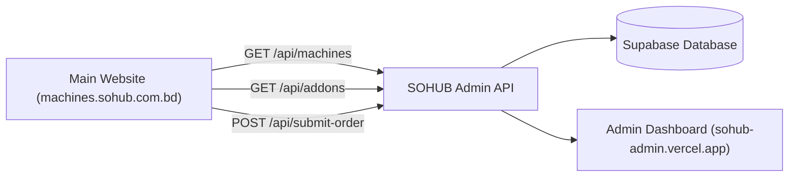

# 🚀 SOHUB Vending Machine - Main Website Integration Guide
> **Target Website:** `machines.sohub.com.bd`  
> **Backend Admin API Base URL:** `https://sohub-admin.vercel.app/api`  
> **Status:** Live & Production Ready (Zero Config Required)

---

## 📌 1. Architecture Overview

The main website (`machines.sohub.com.bd`) fetches real-time machine variants, master add-ons, and sends quotation leads directly to the **SOHUB Admin Panel** via Vercel Serverless REST Endpoints.



### Key Advantages:
- 🔒 **Zero Public Credentials:** No API keys or Supabase credentials are required on `machines.sohub.com.bd`.
- ⚡ **Instant Synchronization:** When you add/edit a machine model or add-on in the Admin Panel, it updates on the main website instantly.
- 📬 **Automated Order Tracking:** All customer requests generate a unique order number (`SHB-XXXXXX`) and appear directly on the Admin Dashboard.

---

## 📡 2. REST API Endpoints Reference

### 1️⃣ Get Active Machine Variants
- **Endpoint:** `GET https://sohub-admin.vercel.app/api/machines`
- **Description:** Returns all active machine models created in the Admin Configurator.

#### Sample Response:
```json
[
  {
    "id": "8f1e2a84-1234-4567-89ab-cdef01234567",
    "title": "SOHUB V-45 Premium Heavy Duty",
    "type": "imported",
    "base_price": 380000,
    "short_description": "Premium imported heavy duty chassis with dual tempered glass & telemetry integration.",
    "image_url": "https://machines.sohub.com.bd/assets/vending-v45.png",
    "chiller_support": true,
    "is_active": true,
    "allowed_addons": ["addon-1", "addon-2", "addon-3"],
    "specifications": {
      "slots": 60,
      "capacity": "450 Snacks & Drinks",
      "dimensions": "1940 x 1030 x 790 mm",
      "temperature_range": "4°C - 25°C",
      "power_consumption": "350W Cooling / 40W Standby",
      "display_type": "21.5\" HD Touchscreen"
    }
  }
]
```

---

### 2️⃣ Get Master Add-ons List
- **Endpoint:** `GET https://sohub-admin.vercel.app/api/addons`
- **Description:** Returns all active official master add-on upgrades.

#### Sample Response:
```json
[
  {
    "id": "addon-1",
    "name": "Built-in Chiller Unit",
    "description": "Refrigeration module for cold beverages, chocolates, and dairy products (4°C - 25°C).",
    "category": "hardware",
    "price": 40000,
    "is_tbd": false,
    "sort_order": 1,
    "is_active": true
  },
  {
    "id": "addon-7",
    "name": "Cashless Payment Gateway Integration",
    "description": "bKash, Nagad, SSLCommerz, NFC Card, & Student/Employee ID Card payment integration.",
    "category": "payment",
    "price": 0,
    "is_tbd": true,
    "sort_order": 7,
    "is_active": true
  }
]
```

---

### 3️⃣ Submit Customer Quotation Lead
- **Endpoint:** `POST https://sohub-admin.vercel.app/api/submit-order`
- **Content-Type:** `application/json`
- **Description:** Submits customer contact details and machine choices to the Admin Panel.

#### Request Body Payload:
```json
{
  "customer_name": "Tanvir Ahmed",
  "customer_email": "tanvir.ahmed@grameenphone.com",
  "customer_phone": "+880 1711-908234",
  "customer_company": "Grameenphone Innovation Hub",
  "delivery_location": "GP House, Bashundhara R/A, Dhaka-1229",
  "chassis_title": "SOHUB V-45 Premium Heavy Duty",
  "chassis_base_price": 380000,
  "selected_addons": [
    {
      "addon_id": "addon-1",
      "addon_name": "Built-in Chiller Unit",
      "final_price": 40000
    },
    {
      "addon_id": "addon-3",
      "addon_name": "POS Payment Module (EBL POS)",
      "final_price": 10000
    }
  ],
  "subtotal": 430000,
  "vat_rate": 5
}
```

#### Sample Response:
```json
{
  "success": true,
  "message": "Order inquiry received successfully!",
  "order_number": "SHB-849201"
}
```

---

## 💻 3. Implementation Code for `machines.sohub.com.bd`

Create a helper file in your main website project: `src/services/sohubAdminService.js`

```javascript
// src/services/sohubAdminService.js
const ADMIN_API_BASE = 'https://sohub-admin.vercel.app/api';

/**
 * 1. Fetch active machine models
 */
export async function fetchMachineVariants() {
  try {
    const res = await fetch(`${ADMIN_API_BASE}/machines`);
    if (!res.ok) throw new Error('Failed to load machine variants');
    return await res.json();
  } catch (error) {
    console.error('Error in fetchMachineVariants:', error);
    return [];
  }
}

/**
 * 2. Fetch master add-on upgrades
 */
export async function fetchMasterAddons() {
  try {
    const res = await fetch(`${ADMIN_API_BASE}/addons`);
    if (!res.ok) throw new Error('Failed to load master add-ons');
    return await res.json();
  } catch (error) {
    console.error('Error in fetchMasterAddons:', error);
    return [];
  }
}

/**
 * 3. Submit customer lead to Admin Dashboard
 */
export async function submitQuotationOrder(orderData) {
  try {
    const res = await fetch(`${ADMIN_API_BASE}/submit-order`, {
      method: 'POST',
      headers: {
        'Content-Type': 'application/json',
      },
      body: JSON.stringify(orderData),
    });
    
    return await res.json();
  } catch (error) {
    console.error('Error in submitQuotationOrder:', error);
    return { success: false, error: error.message };
  }
}
```

---

## 🎨 4. React Page Component Integration Example

Here is how to connect `SnackVendingPage.tsx` on the main website:

```tsx
import React, { useState, useEffect } from 'react';
import { fetchMachineVariants, fetchMasterAddons, submitQuotationOrder } from '../services/sohubAdminService';

export default function SnackVendingPage() {
  const [machines, setMachines] = useState([]);
  const [addons, setAddons] = useState([]);
  const [selectedMachine, setSelectedMachine] = useState(null);
  const [selectedAddons, setSelectedAddons] = useState([]);
  const [loading, setLoading] = useState(true);

  // Contact Form State
  const [formData, setFormData] = useState({
    name: '',
    email: '',
    phone: '',
    company: '',
    location: '',
  });

  // Load data on page load
  useEffect(() => {
    async function initData() {
      const [machineData, addonData] = await Promise.all([
        fetchMachineVariants(),
        fetchMasterAddons()
      ]);
      setMachines(machineData);
      setAddons(addonData);
      if (machineData.length > 0) setSelectedMachine(machineData[0]);
      setLoading(false);
    }
    initData();
  }, []);

  // Calculate live total price
  const calculateSubtotal = () => {
    const base = selectedMachine ? selectedMachine.base_price : 0;
    const addonsTotal = selectedAddons.reduce((acc, a) => acc + (a.price || 0), 0);
    return base + addonsTotal;
  };

  // Submit Lead Handler
  const handleSubmitLead = async (e) => {
    e.preventDefault();
    const subtotal = calculateSubtotal();

    const result = await submitQuotationOrder({
      customer_name: formData.name,
      customer_email: formData.email,
      customer_phone: formData.phone,
      customer_company: formData.company,
      delivery_location: formData.location,
      chassis_title: selectedMachine?.title,
      chassis_base_price: selectedMachine?.base_price,
      selected_addons: selectedAddons.map(a => ({
        addon_id: a.id,
        addon_name: a.name,
        final_price: a.price
      })),
      subtotal: subtotal
    });

    if (result.success) {
      alert(`Thank you! Your quotation request #${result.order_number} has been submitted.`);
    } else {
      alert(`Submission failed: ${result.error}`);
    }
  };

  if (loading) return <div>Loading SOHUB Configurator...</div>;

  return (
    <div className="container mx-auto p-6">
      <h1 className="text-3xl font-bold">Configure Your SOHUB Vending Machine</h1>

      {/* Machine Variant Selection */}
      <div className="my-6 grid grid-cols-1 md:grid-cols-3 gap-4">
        {machines.map((m) => (
          <div
            key={m.id}
            onClick={() => setSelectedMachine(m)}
            className={`p-4 border rounded-xl cursor-pointer ${
              selectedMachine?.id === m.id ? 'border-amber-500 bg-amber-500/10' : 'border-gray-700'
            }`}
          >
            <h3 className="font-bold text-lg">{m.title}</h3>
            <p className="text-sm text-gray-400">{m.short_description}</p>
            <div className="mt-2 text-amber-400 font-bold">BDT {m.base_price?.toLocaleString()}</div>
          </div>
        ))}
      </div>

      {/* Submit Order Form */}
      <form onSubmit={handleSubmitLead} className="space-y-4 max-w-md">
        <input
          type="text"
          placeholder="Your Name"
          required
          value={formData.name}
          onChange={(e) => setFormData({ ...formData, name: e.target.value })}
          className="w-full p-3 bg-gray-800 rounded"
        />
        <input
          type="email"
          placeholder="Email Address"
          required
          value={formData.email}
          onChange={(e) => setFormData({ ...formData, email: e.target.value })}
          className="w-full p-3 bg-gray-800 rounded"
        />
        <button type="submit" className="w-full py-3 bg-amber-500 text-black font-bold rounded">
          Submit Quotation Request (BDT {calculateSubtotal().toLocaleString()})
        </button>
      </form>
    </div>
  );
}
```

---

## 🛠️ Checklist Summary

| Task | Status | Note |
|---|---|---|
| Admin API Endpoints Deployment | ✅ **Live** | `https://sohub-admin.vercel.app/api/*` |
| CORS Configuration | ✅ **Active** | Accepts requests from any domain |
| Dynamic Machine Variants | ✅ **Ready** | Real-time fetch via `/api/machines` |
| 10 Master Add-ons Sync | ✅ **Ready** | Real-time fetch via `/api/addons` |
| Order Lead Generation | ✅ **Ready** | Instant submission via `/api/submit-order` |
