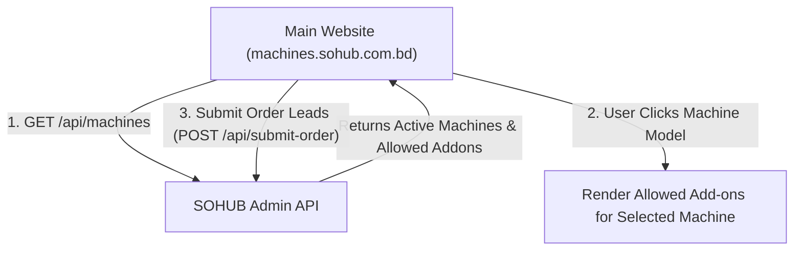

# 🚀 SOHUB Vending Machine - Dynamic Integration Guide
> **Target Website:** `machines.sohub.com.bd`  
> **Backend Admin API Base URL:** `https://sohub-admin.vercel.app/api`  
> **Architecture:** Pure Machine-Driven Add-on Configurator

---

## 📌 1. Dynamic Architecture Overview

In this clean architecture, the main website (`machines.sohub.com.bd`) fetches **only the Machine Variants** created in the Admin Panel. 

Each Machine Variant contains its own list of **`allowed_addons`** (configured inside the Admin Panel modal). When a customer selects a specific machine model on the main website, **only the add-ons enabled for that machine** will be displayed for selection!



---

## 📡 2. API Endpoint Reference

### 1️⃣ Fetch Active Machine Variants
- **Endpoint:** `GET https://sohub-admin.vercel.app/api/machines`
- **Description:** Returns all active machine models along with their technical specifications and allowed add-ons.

#### Sample JSON Response:
```json
[
  {
    "id": "8f1e2a84-1234-4567-89ab-cdef01234567",
    "title": "SOHUB V-45 Premium Heavy Duty",
    "type": "imported",
    "base_price": 380000,
    "short_description": "Premium imported heavy duty chassis with dual tempered glass & telemetry integration.",
    "image_url": "https://machines.sohub.com.bd/assets/vending-v45.png",
    "chiller_support": true,
    "is_active": true,
    "allowed_addons": [
      {
        "addon_id": "chiller-unit",
        "name": "Built-in Chiller Unit",
        "price": 40000,
        "description": "Refrigeration module (4°C - 25°C)."
      },
      {
        "addon_id": "touchscreen-upgrade",
        "name": "Touchscreen Display Upgrade",
        "price": 18000,
        "description": "10-inch interactive HD touchscreen display."
      }
    ],
    "specifications": {
      "slots": 60,
      "capacity": "450 Snacks & Drinks",
      "dimensions": "1940 x 1030 x 790 mm",
      "temperature_range": "4°C - 25°C",
      "power_consumption": "350W Cooling / 40W Standby",
      "display_type": "21.5\" HD Touchscreen"
    }
  }
]
```

---

### 2️⃣ Submit Customer Order Lead
- **Endpoint:** `POST https://sohub-admin.vercel.app/api/submit-order`
- **Content-Type:** `application/json`

#### Request Body Payload:
```json
{
  "customer_name": "Tanvir Ahmed",
  "customer_email": "tanvir.ahmed@grameenphone.com",
  "customer_phone": "+880 1711-908234",
  "customer_company": "Grameenphone Innovation Hub",
  "delivery_location": "GP House, Bashundhara R/A, Dhaka-1229",
  "chassis_title": "SOHUB V-45 Premium Heavy Duty",
  "chassis_base_price": 380000,
  "selected_addons": [
    {
      "addon_id": "chiller-unit",
      "addon_name": "Built-in Chiller Unit",
      "final_price": 40000
    }
  ],
  "subtotal": 420000,
  "vat_rate": 5
}
```

---

## 💻 3. React Frontend Integration Example (`SnackVendingPage.tsx`)

Here is how to fetch machines and display **only that machine's add-ons**:

```tsx
import React, { useState, useEffect } from 'react';

export default function SnackVendingPage() {
  const [machines, setMachines] = useState([]);
  const [selectedMachine, setSelectedMachine] = useState(null);
  const [selectedAddonIds, setSelectedAddonIds] = useState([]);
  const [loading, setLoading] = useState(true);

  // Load Machine Variants from Admin API
  useEffect(() => {
    async function loadMachines() {
      try {
        const res = await fetch('https://sohub-admin.vercel.app/api/machines');
        const data = await res.json();
        setMachines(data);
        if (data.length > 0) setSelectedMachine(data[0]);
      } catch (err) {
        console.error('Error loading machines:', err);
      } finally {
        setLoading(false);
      }
    }
    loadMachines();
  }, []);

  // When selected machine changes, reset selected add-ons
  const handleSelectMachine = (machine) => {
    setSelectedMachine(machine);
    setSelectedAddonIds([]);
  };

  // Toggle Add-on Selection
  const toggleAddon = (addonId) => {
    setSelectedAddonIds((prev) =>
      prev.includes(addonId) ? prev.filter((id) => id !== addonId) : [...prev, addonId]
    );
  };

  // Calculate Subtotal (Base Price + Selected Machine Addons)
  const calculateSubtotal = () => {
    if (!selectedMachine) return 0;
    const base = selectedMachine.base_price || 0;
    const allowed = selectedMachine.allowed_addons || [];
    const addonsTotal = allowed
      .filter((a) => selectedAddonIds.includes(a.addon_id || a.id || a))
      .reduce((acc, curr) => acc + (curr.price || 0), 0);
    return base + addonsTotal;
  };

  if (loading) return <div>Loading Machines...</div>;

  return (
    <div className="container mx-auto p-6 text-white bg-slate-950">
      <h1 className="text-3xl font-bold mb-6">Select Machine Model</h1>

      {/* 1. MACHINE SELECTION */}
      <div className="grid grid-cols-1 md:grid-cols-3 gap-6 mb-8">
        {machines.map((m) => (
          <div
            key={m.id}
            onClick={() => handleSelectMachine(m)}
            className={`p-6 rounded-2xl border cursor-pointer transition ${
              selectedMachine?.id === m.id
                ? 'border-amber-500 bg-amber-500/10'
                : 'border-slate-800 bg-slate-900'
            }`}
          >
            <h3 className="font-bold text-xl mb-2">{m.title}</h3>
            <p className="text-slate-400 text-sm mb-4">{m.short_description}</p>
            <div className="text-2xl font-bold text-amber-400">
              BDT {m.base_price?.toLocaleString()}
            </div>
          </div>
        ))}
      </div>

      {/* 2. ADD-ONS FOR SELECTED MACHINE ONLY */}
      {selectedMachine && (
        <div className="mb-8 p-6 bg-slate-900 rounded-2xl border border-slate-800">
          <h2 className="text-xl font-bold mb-4">
            Available Upgrades for {selectedMachine.title}
          </h2>

          {(!selectedMachine.allowed_addons || selectedMachine.allowed_addons.length === 0) ? (
            <p className="text-slate-500">No extra add-ons required for this model.</p>
          ) : (
            <div className="space-y-3">
              {selectedMachine.allowed_addons.map((addon) => {
                const addonId = addon.addon_id || addon.id || addon;
                const isSelected = selectedAddonIds.includes(addonId);
                return (
                  <div
                    key={addonId}
                    onClick={() => toggleAddon(addonId)}
                    className={`p-4 rounded-xl border flex items-center justify-between cursor-pointer ${
                      isSelected
                        ? 'border-amber-500 bg-amber-500/10'
                        : 'border-slate-800 bg-slate-950'
                    }`}
                  >
                    <div>
                      <div className="font-bold">{addon.name || addonId}</div>
                      <div className="text-xs text-slate-400">{addon.description}</div>
                    </div>
                    <div className="font-bold text-amber-400">
                      + BDT {addon.price?.toLocaleString()}
                    </div>
                  </div>
                );
              })}
            </div>
          )}
        </div>
      )}

      {/* 3. TOTAL ESTIMATE */}
      <div className="p-6 bg-amber-500/10 border border-amber-500/30 rounded-2xl flex justify-between items-center">
        <div>
          <div className="text-sm text-slate-400">Estimated Total</div>
          <div className="text-3xl font-bold text-amber-400">
            BDT {calculateSubtotal().toLocaleString()}
          </div>
        </div>
      </div>
    </div>
  );
}
```

---

## ✅ Summary

1. **Zero Hardcoded Addons:** The main site no longer queries a global 10 add-ons list.
2. **Machine-Driven:** Each machine model returned from `GET /api/machines` brings its own specific add-ons list.
3. **Seamless UX:** When a customer clicks a different machine model, the frontend instantly displays only the add-ons relevant to that model!
